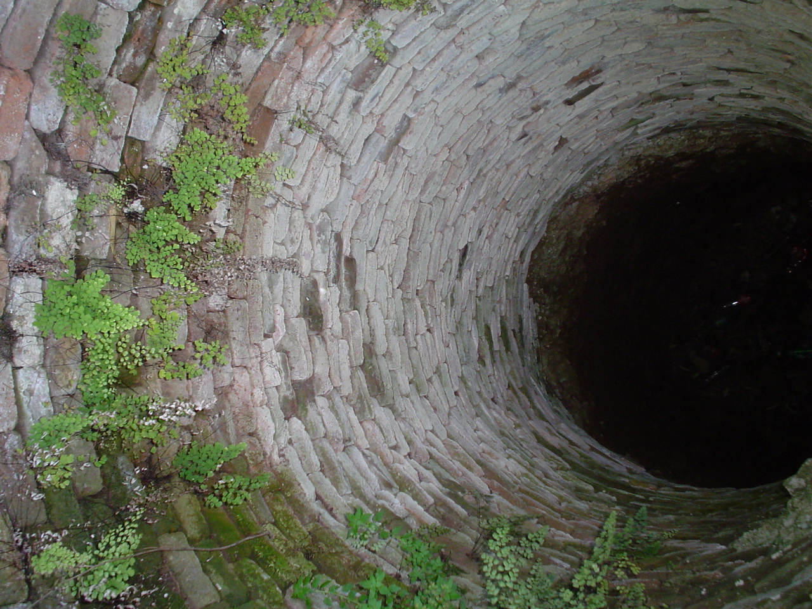
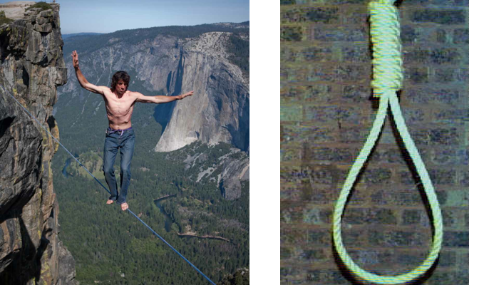

!SLIDE 
# Dynamic Web Development with Ruby and Rails
### anders.janmyr@jayway.com
### http://anders.janmyr.com
### @andersjanmyr

!SLIDE center

.notes A priest fell into a well, but managed to grab hold of a small root an the way down. He started to scream, "Hello, is there anybody up there?". Nothing happened! He screamed again "Hello, is there anybody up there?", Suddenly a sound of thunder came from the clouds above the well. "This is your God speaking, let go of the root and I will save you!" A brief silence then the priest screamed, "Is there anybody else up there?"

!SLIDE center
#  Static vs Dynamic

!SLIDE center
#  Dynamic

