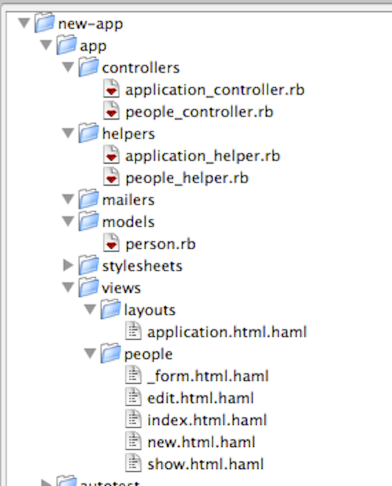
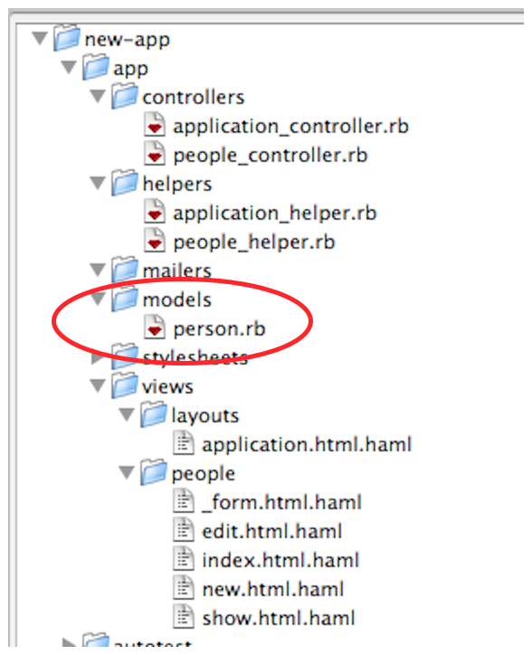
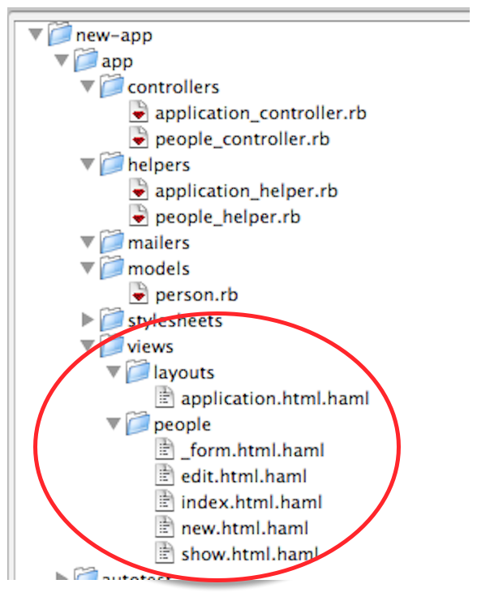

!SLIDE center
# App

!SLIDE commandline
# rails generate scaffold

    $ rails g scaffold person firstname:string lastname:string age:integer
          invoke  active_record
          create    db/migrate/20101130125328_create_people.rb
          create    app/models/person.rb
          invoke    rspec
          create      spec/models/person_spec.rb
          invoke      factory_girl
          create        spec/factories/people.rb
           route  resources :people
          invoke  responders_controller
          create    app/controllers/people_controller.rb
          invoke    haml
          create      app/views/people
          create      app/views/people/index.html.haml
          create      app/views/people/edit.html.haml
          create      app/views/people/show.html.haml
          create      app/views/people/new.html.haml
          create      app/views/people/_form.html.haml
          invoke    rspec
          create      spec/controllers/people_controller_spec.rb
          invoke      helper
          create        spec/helpers/people_helper_spec.rb
          create      spec/routing/people_routing_spec.rb
          invoke      rspec
          create        spec/requests/people_spec.rb
          invoke    helper
          create      app/helpers/people_helper.rb
          invoke      rspec

!SLIDE center
# Controllers

!SLIDE small
# Controller

    @@@ruby
    class PostsController < ApplicationController
      # GET /posts
      # GET /posts.xml
      def index
        debugger
        @posts = Post.all

        respond_to do |format|
          format.html # index.html.erb
          format.xml  { render :xml => @posts }
        end
      end
      ...
    end

!SLIDE
# Controller with Responder

    @@@ruby
    class PeopleController < ApplicationController
      # GET /people
      # GET /people.xml
      def index
        @people = Person.all
        respond_with(@people)
      end
      ...
    end

!SLIDE small
# Controller, InheritedResources

    @@@ruby
    class ProjectsController < InheritedResources::Base
      respond_to :html, :xml, :json
    end

!SLIDE center
# Models

!SLIDE small
# Model ActiveRecord

    @@@ruby
    class Person < ActiveRecord::Base
        # Look Ma, no fields
    end

!SLIDE small
# Model ActiveRecord

    @@@ruby
    class Person < ActiveRecord::Base
      table_name :people
      primary_key :id
    end

!SLIDE small
# Model db/schema.rb

    @@@ruby
    ActiveRecord::Schema.define(:version => 20101130125328) do

      create_table "people", :force => true do |t|
        t.string   "firstname"
        t.string   "lastname"
        t.integer  "age"
        t.datetime "created_at"
        t.datetime "updated_at"
      end

    end

!SLIDE small
# Model Mongoid

    @@@ruby
    class Animal
      include Mongoid::Document
      field :firstname, :type => String
      field :lastname, :type => String
      field :age, :type => Integer
    end

!SLIDE center
# Views

!SLIDE small
# people/index.html.haml

    @@@python
    %h1 People
    %table
      %tr
        %th Firstname
        %th Lastname
        %th Age

      - @people.each do |person|
        %tr
          %td= person.firstname
          %td= person.lastname
          %td= person.age
          %td= link_to 'Show', person
          %td= link_to 'Edit', edit_person_path(person)
          %td= link_to 'Destroy', person, :confirm => 'Are you sure?', :method => :delete

    = link_to 'New Person', new_person_path

!SLIDE small
# people/edit.html.haml

    @@@python
    %h1 Editing person

    = render 'form'

    = link_to 'Show', @person
    = link_to 'Back', people_path

!SLIDE small
# people/_form.html.haml

    @@@python
    = simple_form_for(@person) do |f|
      - if @person.errors.any?
        #error_explanation
          %h2
            = pluralize(@person.errors.count, "error")
            prohibited this person from being saved:
          %ul
          - @person.errors.full_messages.each do |msg|
            %li= msg

      .inputs
        = f.input :firstname
        = f.input :lastname
        = f.input :age

      .actions
        = f.button :submit

!SLIDE small
# Sass, variables

    @@@css
    @import "mixins.scss";

    $main-color: #36393D;
    $secondary-color: #eee;

    #container {
        width: 100%;
        h1, h2, h3 {
            font-family: helvetica,arial,sans-serif;
            color: $main-color;
        }
    }

!SLIDE small
# Sass, mixins

    @@@css
    @mixin border-radius($tl, $tr, $br, $bl) {
        -webkit-border-radius: $tl $tr $br $bl;
        -moz-border-radius: $tl $tr $br $bl;
        border-radius: $tl $tr $br $bl;
    }

    table {
        width: 90%;
        @include border-radius($border-radius, $border-radius, 0, 0);
        padding: 1em;
    }

