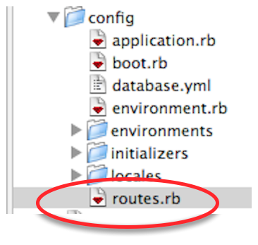

!SLIDE center
# Routing

!SLIDE small
# match

    @@@ruby
    NewApp::Application.routes.draw do
      match "/people/:id" => 'people#show'
    end

!SLIDE commandline
# rake routes

    $ rake routes
    /people/:id(.:format) {:controller=>"people", :action=>"show"}

!SLIDE small
# match

    @@@ruby
    match "/people/:id"=>'people#show', :as => 'person'

    = link_to "Person", person_path(@person)

!SLIDE commandline
# rake routes

    $ rake routes
    person  /people/:id(.:format) {:controller=>"people", :action=>"show"}

!SLIDE small
# resources

    @@@ruby
    resources :people

    = link_to "People", people_path
    = link_to "New Person", new_person_path
    = link_to "Show Person", person_path(@person)
    = link_to "Edit Person", edit_person_path(@person)

!SLIDE commandline
# rake routes

    $ rake routes
         people GET    /people(.:format)          {:action=>"index", :controller=>"people"}
                POST   /people(.:format)          {:action=>"create", :controller=>"people"}
     new_person GET    /people/new(.:format)      {:action=>"new", :controller=>"people"}
    edit_person GET    /people/:id/edit(.:format) {:action=>"edit", :controller=>"people"}
         person GET    /people/:id(.:format)      {:action=>"show", :controller=>"people"}
                PUT    /people/:id(.:format)      {:action=>"update", :controller=>"people"}
                DELETE /people/:id(.:format)      {:action=>"destroy", :controller=>"people"}

