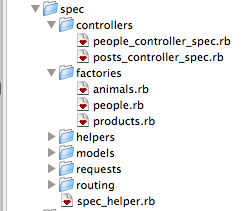

!SLIDE center
# RSpec

!SLIDE small
# Terminology

    @@@ruby
    rspec           == test_unit
    specification   == test_group
    example         == test
    expectation     == assertion

!SLIDE small
# A spec

    @@@ruby
    require 'spec_helper'

    describe Item do
      pending "Todo"
    end

!SLIDE small
# A spec with examples

    @@@ruby
    describe 'A guest user' do

        it 'should not see private items' do
            guest = User.find(:guest)
            guest.private_items.size.should == 0
        end

        it 'should see public items' do
            guest = User.find(:guest)
            guest.public_items.size.should == 4
        end

!SLIDE commandline incremental
# Running the specs

    $ rspec spec
    A guest user
      should not see private items
      should see public items

!SLIDE small
# before and matchers

    @@@ruby
    describe 'A guest user' do
        before do
            setup_items
            @guest = User.find(:guest)
        end

        it 'should not see private items' do
            @guest.private_items.should be_empty
        end

        it 'should see public items' do
            @guest.public_items.size.should == 4
            @guest.should have(4).public_items
        end
    end

    

!SLIDE small
# Error expectation

    @@@ruby
    lambda { this_block }.should raise_error

!SLIDE small
# Change expectation

    @@@ruby
    describe 'add ability to guest user' do
        it 'should change the role to user' do
            expect {
                User.ability << Read
            }.to change { User.role }.from(:guest).to(:reader)
        end

    end

